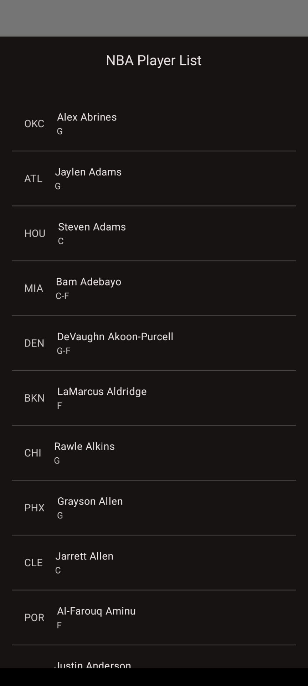
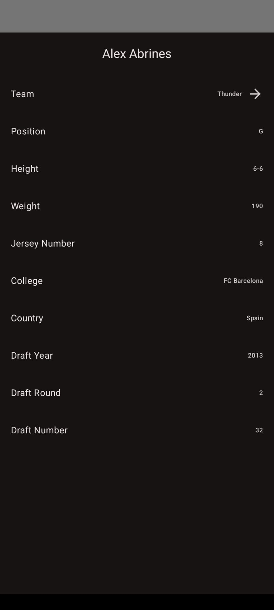
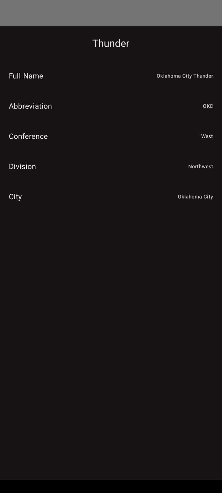

# NBA Database Mobile

An Android application built with Jetpack Compose that leverages Retrofit to interact with the free [balldontlie API](https://www.balldontlie.io/) for retrieving NBA data.

| Players List                             | Player Detail                             | Team Detail                             |
|------------------------------------------|-------------------------------------------|-----------------------------------------|
|   |   |   |


## Features

- **Jetpack Compose**: Modern toolkit for building native UI.
- **Retrofit**: Simplifies API interactions.
- **MVI Architecture**: Ensures a unidirectional data flow with clear separation of concerns.
    - **ViewModel**: Manages UI-related data and handles business logic.
    - **Contract**: Defines events and states for each screen.
    - **Content**: Composable functions that render the UI based on the current state.
- **Dependency Injection**: Uses Koin for dependency injection.
- **Type-Safe Navigation**: Robust navigation between screens using Compose's type-safe navigation.
- **Modular Architecture**: Organized into `app`, `balldontlieapi`, `data`, `domain`, and `implementation` modules for scalability and maintainability.

## Modules Overview

- **app**: The main Android application module containing UI and UI related logic.
- **balldontlieapi**: Handles API interactions with the balldontlie service using Retrofit.
- **data**: Holds the domain data model.
- **domain**: Contains definition of business logic interfaces.
- **implementation**: Provides implementations for domain interfaces.

## Setup

### Prerequisites

- **Balldontlie API key**

The project requires a `BALLDONTLIE_API_KEY`. Obtain your API key and set it in the environment or `local.properties`.

#### Option 1: Environment Variable

Set the `BALLDONTLIE_API_KEY` in your shell:

```bash
export BALLDONTLIE_API_KEY="your-api-key-here"
```

#### Option 2: `local.properties`

Add the following line to `local.properties` (ensure this file is not committed to version control):

```properties
BALLDONTLIE_API_KEY=your-api-key-here
```

## License

This project is licensed under the [MIT License](LICENSE).

## Acknowledgements

- [balldontlie API](https://www.balldontlie.io/) for providing free NBA data.

---

For any issues or contributions, please open an issue or submit a pull request.
